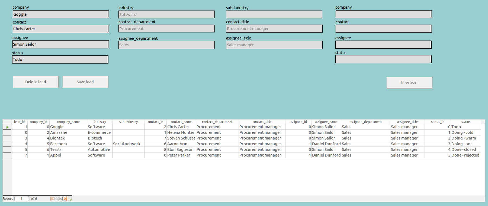
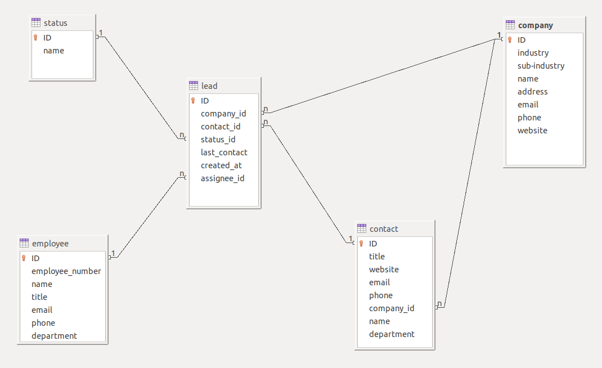

# LibreCRM

LibreCRM is a customer relationship management (CRM) system based on LibreOffice Base, combining the flexibility and agility of spreadsheets with the consistency and scalability of databases.



- [Requirements](#requirements)
- [Usage](#usage)
- [Forms](#forms)
- [Database](#database)
- [Data model](#data-model)
- [Install from source](#install-from-source)
- [Extract xml files from odb file](#extract-xml-files-from-odb-file)

## Requirements

You need to have LibreOffice installed on your system.

## Usage

1. Download the latest release as a `zip` file here.
2. Extract the zip file
3. Launch the `libre_crm.odb` file by double-clicking, or use the command line

    ``` bash
    # LibreOffice as system package
    libreoffice --base /path/to/libre_crm.odb

    # LibreOffice as snap package
    /snap/bin/libreoffice --base /path/to/libre_crm.odb
    ```

## Forms

The forms for CRUD access on the database are created in LibreOffice Base and saved in the `libre_crm.odb` file.

## Database

Currently, the database is an embedded HSQLDB. In future releases, the embedded database is replaced by an external database, like Postgres or Firebird. In this split database architecture, the database is separated from the frontend (i.e. forms, reports, macros, etc.).

## Data model



Customer relationship management in LibreCRM is based on a simple data model with the `lead` table as the centerpiece. A lead has foreign key relationships with the `company`, `contact`, `employee`, and `status` table.

Companies comprise private (business entities, financial entities, nonprofit organizations) and public entities (government organizations).

The 6-state lead workflow is based on the following Kanban-style (Todo, Doing, Done) lead status:

1. Todo
1. Doing - cold
1. Doing - warm
1. Doing - hot
1. Done - closed
1. Done - rejected

The Kanban status *Doing* is subdivided into *cold*, *warm*, and *hot* leads which corresponds to

- information qualified lead,
- marketing qualified lead, and
- sales qualified lead

in sales terminology.

The workflow is either finished with a success (*Done - closed*) or failure (*Done - rejected*).

## Install from source

``` bash
# Clone github repository
git clone git@github.com:quambene/libre_crm.git
cd libre_crm

# Build and install libre_crm.odt file
./install.sh
```

## Extract xml files from odb file

``` bash
cd libre_crm

# Extracts xml files to src/odb
./extract.sh
```
